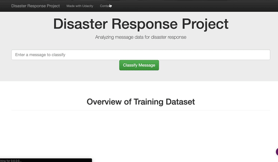

# Disaster Response Pipeline Project

### Description
In this project, disaster data from [Figure Eight](https://www.figure-eight.com) will be analyzed to build a model for an API that classifies disaster messages.

In the Project Workspace, there is a data set containing real messages that were sent during disaster events. The project will create a machine learning pipeline to categorize the events so that the messages could be sent to an appropriate disaster relief agency.

This project will also include a web app where an emergency worker can input a new message and get classification results in several categories. The web app will also display visualizations of the data.

 

### Implementation and running instructions
1. Preparation step

    - ETL Pipeline
    
    The first step in the project is to combine the given messages and categories given in `/data` folder and convert into an SQLite database.
    
    To run ETL pipeline that cleans data and stores in database
        `python data/process_data.py data/disaster_messages.csv data/disaster_categories.csv data/DisasterResponse.db`
    
    - ML Pipeline
    
    The second step is to train a pipeline model using CountVectorizer, TF-IDF Vectorizer and RandomForest classifier. The trained model 
    is stored in a pickle file to be used in the Flask web app 
    
    To run ML pipeline that trains classifier and saves
        `python models/train_classifier.py data/DisasterResponse.db models/classifier.pkl`

2. Running the web app

    - Flask Web app
    
    The webapp uses the trained model pickle file to classify the messages in real time. It also shows an overview of the training dataset using a stacked 
    barplot and a word cloud of most frequent words in disaster messages.
    
    To run the flask in your browser, run the command
    `python app/run.py` in your project root folder and open http://0.0.0.0:3001/

### Packages used
Preparation step requires the following packages: nltk, pandas, numpy, sklearn, re, sys, warnings, sqlalchemy

To run the webapp successfully, following packages are needed: flask, plotly, json, pandas, wordcloud, sqlalchemy, nltk, sklearn

### File Structure
- `app/`
  - `template/`
    - `master.html`  -  Main page of web application.
    - `go.html`  -  Classification result page of web application.
  - `run.py`  - Flask applications main file.

- `data/`
  - `disaster_categories.csv`  - Disaster categories dataset.
  - `disaster_messages.csv`  - Disaster Messages dataset.
  - `process_data.py` - The data processing pipeline script.
  - `DisasterResponse.db`   - The database with the merged and cleaned data.

- `models/`
  - `train_classifier.py` - The NLP and ML pipeline script.

 - `images/` 
 	- `project.gif` - Demo gif running the flask app

### References

Thanks to Udacity and Figure Eight for providing the opportunity to work on this project. Following links/resources helped me to build this project successfully
 
 - https://www.datacamp.com/community/tutorials/wordcloud-python
 - https://github.com/PrashantSaikia/Wordcloud-in-Plotly
 - https://stackoverflow.com/questions/10592605/save-classifier-to-disk-in-scikit-learn